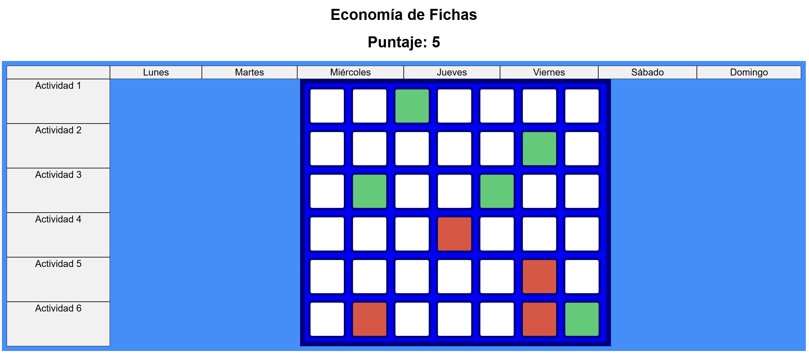

# Token Economy / Economia de fichas

A [token economy](https://en.wikipedia.org/wiki/Token_economy#:~:text=remove%20this%20message)-,(Learn%20how%20and%20when%20to%20remove%20this%20message),be%20exchanged%20for%20other%20reinforcers.) is a system of contingency management based on the systematic reinforcement of target behavior. The reinforcers are symbols or tokens that can be exchanged for other reinforcers.

This repository contains a simple Javascript running on html. It shows a token economy table (screenshot shown below) listing everyday of the week againts different activities. In each box/white space, the token can be set to red (negative/undone) or green (positive/done) by clicking the box; alternative the box can be left empty. Each positive/ done activity is counted in the total score (puntaje). The token table is accessible at the following link [https://macinj1.github.io/token-economy/](https://macinj1.github.io/token-economy/).

